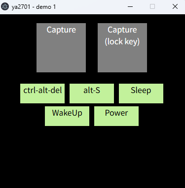

ya2701 means Yet Another 2701


This is unofficial "driver" for a USB cable called "USB3 Smart Data Link". It uses a chip called PL2701.

The mainly purpose for this project is get rid of that old software.

I know nodejs is slower than cpp. I know that.

All the information here is what I guessed in my dreams, it is unreliable.

use [zadig](https://zadig.akeo.ie/) to setup the WinUSB driver properly in windows

usage:
```sh
npm install
npm run electron
```

本软件为短期Demo试做，抛砖引玉，其内部含有大量优化/迭代空间。当前软件适用于绿联USB3.0对拷线（2025年三月购入），可用于将鼠标键盘数据转发至“对拷线”上。

本项目将会归档，不再有后续更新，如果未来受到关注，或有开发计划，则会考虑重启。如果您对此软件感兴趣，欢迎在B站与我私信交流（@Frto027）。

